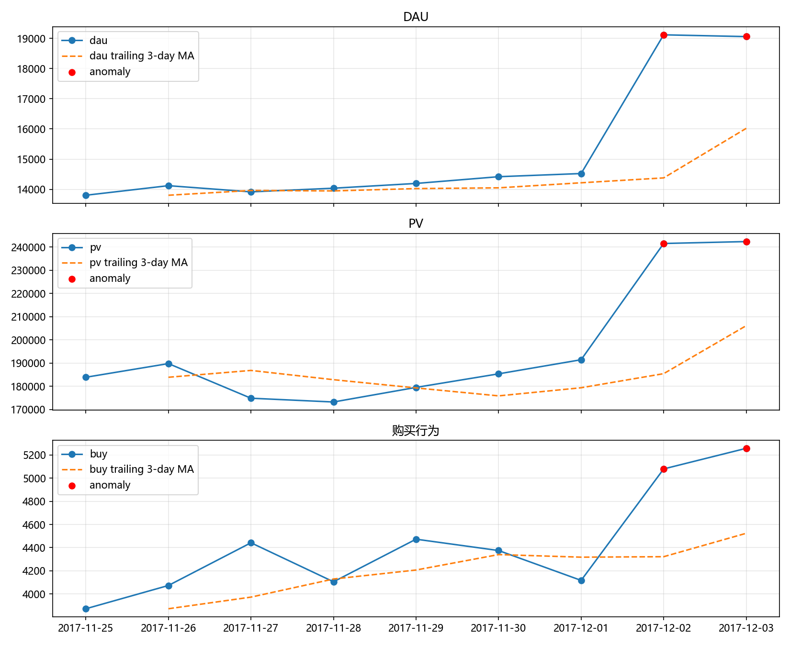

# 基于大模型的电商经营异动归因与智能日报系统

公开仓库：<https://github.com/iccccc777/ic-ecommerce-anomaly-report>

一个面向电商经营分析的端到端项目：从用户行为数据出发，完成 SQL 数仓、指标口径、异常检测、异动归因、LLM 日报、人工校准、Streamlit 看板和业务结论。



## 项目背景

电商平台每天都会产生大量用户行为数据，单纯的指标波动无法直接指导运营。本项目围绕一个具体经营问题展开：

> 2017-12-02 和 2017-12-03 的活跃与购买增长是否只是周末波动？增长主要集中在哪些时段、类目和用户变化上？

项目使用阿里云天池“淘宝用户行为数据集”，覆盖 2017-11-25 至 2017-12-03。原始数据约 1 亿行，包含用户、商品、类目、行为类型和时间戳。

分析链路：

```text
数据抽样与清洗
-> SQLite 数仓
-> 指标口径
-> 异常检测
-> 异动归因
-> DeepSeek 日报初稿
-> 人工校准
-> Streamlit 看板与业务建议
```

## 核心结论

- 2017-12-02 和 12-03 是连续强异动日。DAU 分别为 19,118 和 19,059，较 7 天前同星期日期分别增长 38.50% 和 34.97%；购买行为分别增长 31.20% 和 29.09%。
- 流量和购买同步增长。12-02 的 `buy_to_pv` 为 2.1033%，12-03 为 2.1696%，与 12-01 的 2.1503% 接近，购买效率没有明显被稀释。
- 12-02 较 12-01 的购买增量共 +963，其中 16-21 时贡献 +548，占总增量 56.91%，晚间是主要变化窗口。
- DAU 净增 +4,595，其中两日都活跃 14,258 人、新增活跃 4,860 人、流失 265 人。增长由新增活跃用户驱动，但数据不能证明他们是新注册用户，也不能证明来自外部渠道。
- 类目增长分散，Top 5 类目只贡献约 9.45% 的购买增量，头部类目各增加 21 次，不能据此单独认定爆款类目。

完整复述见 [docs/13_面试故事.md](docs/13_面试故事.md)，问题与证据映射见 [docs/12_项目复盘.md](docs/12_项目复盘.md)。

## 目录结构

```text
project_a/
├─ data/                         # 原始数据、抽样文件和 SQLite；本地生成，不提交
│  └─ README.md
├─ docs/                         # 数据说明、指标口径、方法、复盘和面试故事
├─ python/                       # 建库、指标、异常、归因、AI 日报和看板脚本
├─ sql/                          # SQLite、MySQL 8 和 PostgreSQL 方言 SQL
├─ tests/                        # MySQL 迁移与 PostgreSQL 静态检查
├─ outputs/                      # 指标 CSV、图表、日报、业务报告和 MySQL 结果
│  └─ mysql/
├─ .env.example                  # API Key 配置模板
├─ requirements.txt
└─ 启动看板.bat
```

仓库只提交代码、SQL、文档和轻量结果。`.env`、`.venv`、原始 CSV、抽样 CSV、SQLite 数据库和运行日志均被 `.gitignore` 排除。

## 已有产物入口

- 看板：[python/08_streamlit_dashboard.py](python/08_streamlit_dashboard.py)
- 人工校准日报：[outputs/daily_report_calibrated.md](outputs/daily_report_calibrated.md)
- AI 日报初稿：[outputs/daily_report.md](outputs/daily_report.md)
- 人工校准业务报告：[outputs/business_report_calibrated.md](outputs/business_report_calibrated.md)
- 异常检测结果：[outputs/anomaly_detection.csv](outputs/anomaly_detection.csv)
- 异常检测图：[outputs/anomaly_chart.png](outputs/anomaly_chart.png)
- AI 调用记录：[outputs/ai_call_log.json](outputs/ai_call_log.json)
- 数据说明：[docs/01_数据说明.md](docs/01_数据说明.md)
- 指标口径：[docs/05_指标口径.md](docs/05_指标口径.md)
- 项目复盘：[docs/12_项目复盘.md](docs/12_项目复盘.md)
- 面试故事：[docs/13_面试故事.md](docs/13_面试故事.md)
- 数据库迁移说明：[docs/14_数据库迁移.md](docs/14_数据库迁移.md)
- MySQL 迁移结果：[outputs/mysql/](outputs/mysql/)

## 环境准备

要求 Python 3.10+。

```powershell
python -m venv .venv
.\.venv\Scripts\Activate.ps1
python -m pip install --upgrade pip
python -m pip install -r requirements.txt
```

如果 PowerShell 阻止激活脚本，可只对当前终端临时放行：

```powershell
Set-ExecutionPolicy -Scope Process -ExecutionPolicy Bypass
```

## 数据准备

原始数据不随仓库提交。请从天池数据集页下载：

<https://tianchi.aliyun.com/dataset/649>

将文件放到：

```text
data/UserBehavior_raw.csv
```

本项目使用的数据版本：

| 项目 | 值 |
|---|---|
| 原始行数 | 100,150,807 |
| 文件大小 | 3,672,347,465 字节 |
| SHA256 | `46FDD7D389C1DDC7922EB7D9014AF5573A4A3045DA28C6C46197636873D8F1A9` |
| 分析窗口 | 2017-11-25 至 2017-12-03 |

## 运行命令

### 直接查看现有结果

已有 CSV、图表、日报和报告位于 `outputs/`，不需要重建数据即可查看 Markdown：

```powershell
Get-Content .\outputs\daily_report_calibrated.md
Get-Content .\outputs\business_report_calibrated.md
```

### 启动 Streamlit 看板

```powershell
python -m streamlit run python\08_streamlit_dashboard.py
```

浏览器默认打开：

```text
http://localhost:8501
```

也可以双击 `启动看板.bat`。

### 从原始数据完整重建

`02_build_sqlite.py` 会扫描约 1 亿行原始数据，再次生成抽样 CSV 和 SQLite 数据库，耗时和磁盘占用较高。

```powershell
python python\01_quick_inspect.py
python python\02_build_sqlite.py
python python\03_daily_metrics.py
python python\04_funnel_retention.py
python python\05_anomaly_detection.py
python python\06_attribution.py
python python\07_ai_daily_report.py
```

### 配置 AI 日报

复制 `.env.example` 为 `.env`，填入 DeepSeek 或通义千问 API Key：

```text
DEEPSEEK_API_KEY=sk-your-key
# DASHSCOPE_API_KEY=sk-your-key
```

然后运行：

```powershell
python python\07_ai_daily_report.py
```

脚本会生成 `outputs/daily_report.md` 并记录模型、提示词和返回内容到 `outputs/ai_call_log.json`。对外使用的最终版本应为人工校准后的 `outputs/daily_report_calibrated.md`。

### MySQL 8 迁移与校验

在 `.env` 中配置：

```text
MYSQL_HOST=127.0.0.1
MYSQL_PORT=3306
MYSQL_USER=root
MYSQL_PASSWORD=your-password
MYSQL_DATABASE=ic_ecommerce
```

迁移 SQLite 抽样数据并生成 MySQL 结果：

```powershell
python python\09_migrate_to_mysql.py --recreate
```

校验 MySQL 与 SQLite 结果：

```powershell
python python\10_validate_mysql_migration.py
```

本次真实迁移已覆盖 1,966,733 行行为记录，7 个结果文件全部通过一致性校验。详细差异见 [docs/14_数据库迁移.md](docs/14_数据库迁移.md)。

## 数据与口径

- 抽样：按 `user_id` 稳定哈希保留约 2% 用户，得到 19,476 个用户、1,966,733 行行为。
- 清洗：只保留分析窗口内记录，清洗后 1,965,596 行。
- DAU：当天有任意行为的去重用户数。
- PV、收藏、加购、购买：当天对应行为事件数。
- 购买/浏览比：`buy / pv`，不是支付金额转化率。
- GMV、客单价：数据没有价格和订单金额，未计算。
- MAU：只有 9 天窗口，未把窗口用户数包装成 MAU。

完整定义见 [docs/05_指标口径.md](docs/05_指标口径.md) 和 [docs/06_漏斗与留存.md](docs/06_漏斗与留存.md)。

## 局限

- 用户级抽样约 2%，指标不能直接外推全量业务，小类目和小组波动噪声较大。
- 数据只有 9 天，留存受窗口左截断影响，不能当作真实获客留存。
- `funnel.csv` 是窗口期用户行为重叠率，不是严格顺序漏斗。
- 缺少价格和订单金额，无法计算 GMV、客单价和收入。
- 缺少活动、渠道、曝光、库存和竞品数据，异常和归因是相关性分析，不能证明因果。
- AI 日报只是初稿，所有数字和结论仍需人工校准。
- MySQL 已完成真实实例迁移验证；PostgreSQL 已完成方言和静态检查，但当前机器未运行 PostgreSQL，未做实例级验证。

## 下一步

1. 补充价格和订单表，建立行为指标到收入指标的闭环。
2. 接入活动、渠道和曝光数据，验证本次增长的可能来源。
3. 对 16-21 时运营动作做真实 A/B 实验，不做事后伪实验。
4. 按首次浏览、首次加购/收藏、首次购买重做严格漏斗。
5. 使用更长窗口计算 MAU、复购和高价值用户分层。
6. 如有 PostgreSQL 环境，执行 `sql/postgresql/` 并补充实例级验证记录。
